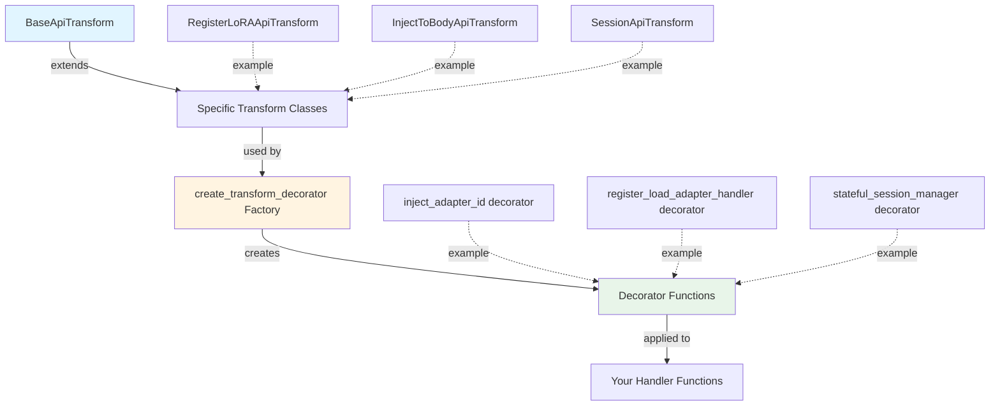
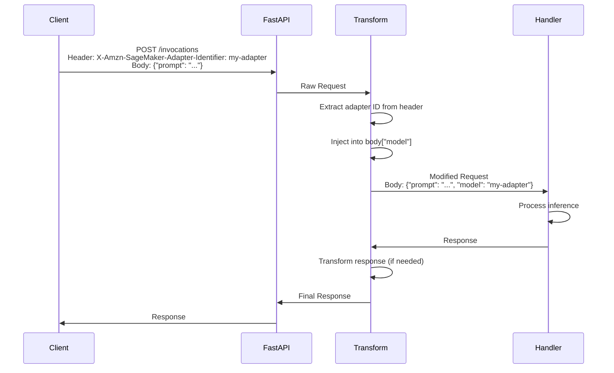
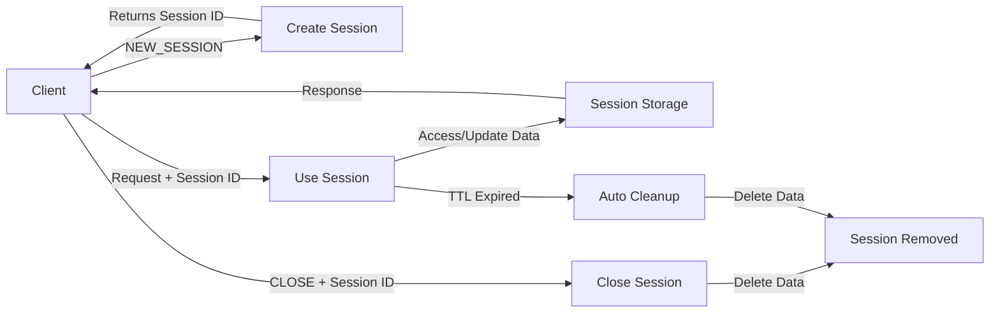
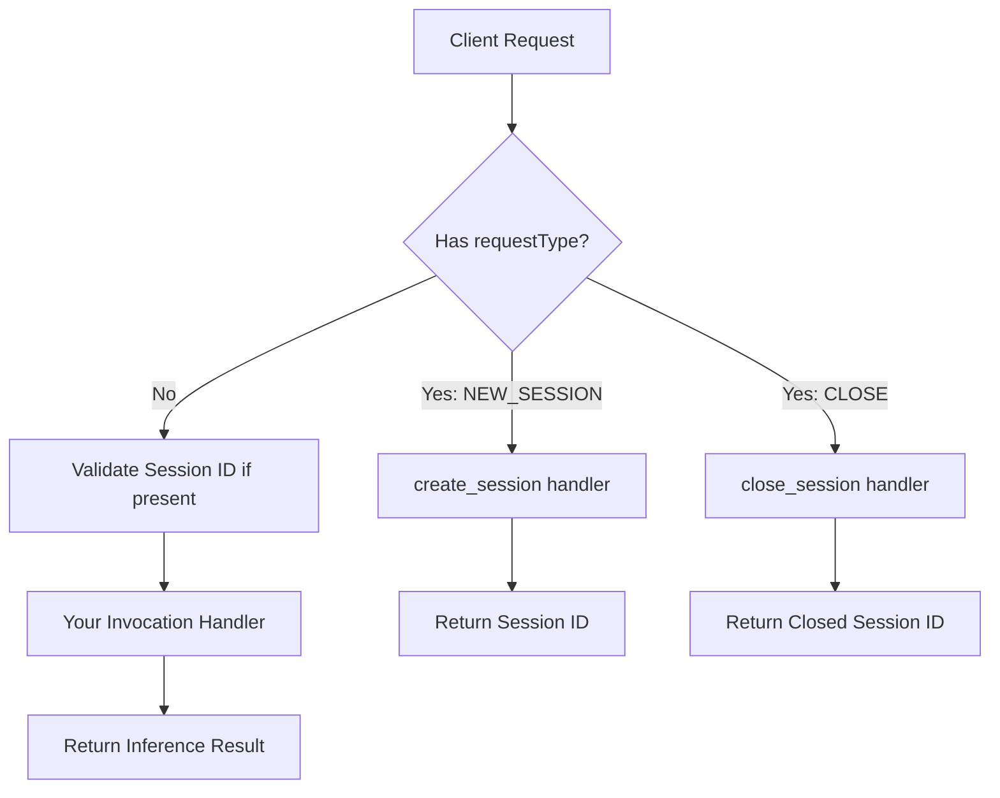

# MHCS Integration Runbook

**Version**: 1.0  container
**Last Updated**: November 16, 2025  
**Target Audience**: ML framework developers integrating with Amazon SageMaker

---

## Table of Contents

1. [Introduction](#1-introduction)
   - 1.1 [What is MHCS?](#11-what-is-mhcs)
   - 1.2 [Prerequisites](#12-prerequisites)
   - 1.3 [How to Use This Guide](#13-how-to-use-this-guide)

2. [Quick Start](#2-quick-start)
   - 2.1 [Use Case 1: Basic SageMaker Compatibility](#21-use-case-1-basic-sagemaker-compatibility)
   - 2.2 [Use Case 2: Multi-LoRA Support](#22-use-case-2-multi-lora-support)
   - 2.3 [Use Case 3: Sticky Session Support](#23-use-case-3-sticky-session-support)
   - 2.4 [Use Case 4: Runtime Custom Code Injection](#24-use-case-4-runtime-custom-code-injection)

3. [Core Integration](#3-core-integration)
   - 3.1 [Understanding the Bootstrap Function](#31-understanding-the-bootstrap-function)
   - 3.2 [Handler Registration Pattern](#32-handler-registration-pattern)
   - 3.3 [Handler Priority System](#33-handler-priority-system)
   - 3.4 [Integration Checklist](#34-integration-checklist)
   - 3.5 [Complete Integration Example](#35-complete-integration-example)

4. [Transform Decorators](#4-transform-decorators)
   - 4.1 [Transform System Overview](#41-transform-system-overview)
   - 4.2 [Transform System Components](#42-transform-system-components)
   - 4.3 [JMESPath Basics](#43-jmespath-basics)
   - 4.4 [Creating Custom Transforms](#44-creating-custom-transforms)

5. [LoRA Adapter Support](#5-lora-adapter-support)
   - 5.1 [LoRA Overview](#51-lora-overview)
   - 5.2 [Adapter ID Injection with @inject_adapter_id](#52-adapter-id-injection-with-inject_adapter_id)
   - 5.3 [Load/Unload Adapter Handlers](#53-loadunload-adapter-handlers)
   - 5.4 [Complete LoRA Example](#54-complete-lora-example)

6. [Session Management](#6-session-management)
   - 6.1 [Session Overview](#61-session-overview)
   - 6.2 [Session Environment Variables](#62-session-environment-variables)
   - 6.3 [Session Validation Behavior](#63-session-validation-behavior)
   - 6.4 [Using @stateful_session_manager](#64-using-stateful_session_manager)
   - 6.5 [Session Request Types and Headers](#65-session-request-types-and-headers)
   - 6.6 [Complete Session Example](#66-complete-session-example)

7. [Supervisor Process Management](#7-supervisor-process-management)
   - 7.1 [Supervisor Overview](#71-supervisor-overview)
   - 7.2 [Using standard-supervisor](#72-using-standard-supervisor)

8. [Customer Customization Patterns](#8-customer-customization-patterns)
   - 8.1 [Customer Override Methods](#81-customer-override-methods)
   - 8.2 [Priority Resolution Examples](#82-priority-resolution-examples)
   - 8.3 [Framework Developer Guidance](#83-framework-developer-guidance)

9. [SGLang Integration Example](#9-sglang-integration-example)
   - 9.1 [SGLang Architecture](#91-sglang-architecture)
   - 9.2 [SGLang Integration Example](#92-sglang-integration-example)
   - 9.3 [SGLang-Specific Considerations](#93-sglang-specific-considerations)

10. [Configuration Reference](#10-configuration-reference)
    - 10.1 [Environment Variables Tables](#101-environment-variables-tables)
    - 10.2 [Handler Priority Resolution](#102-handler-priority-resolution)

11. [Testing & Validation](#11-testing--validation)
    - 11.1 [Local Testing Guide](#111-local-testing-guide)
    - 11.2 [LoRA Adapter Testing](#112-lora-adapter-testing)
    - 11.3 [Customer Override Testing](#113-customer-override-testing)
    - 11.4 [Integration Test Examples](#114-integration-test-examples)

12. [Troubleshooting](#12-troubleshooting)
    - 12.1 [Common Issues](#121-common-issues)
    - 12.2 [Debug Logging](#122-debug-logging)
    - 12.3 [Patterns and Anti-Patterns](#123-patterns-and-anti-patterns)

13. [API Reference](#13-api-reference)
    - 13.1 [Core Decorators](#131-core-decorators)
    - 13.2 [LoRA Decorators](#132-lora-decorators)
    - 13.3 [Session Decorator and Bootstrap Function](#133-session-decorator-and-bootstrap-function)
    - 13.4 [Parameter Reference Tables](#134-parameter-reference-tables)

14. [Additional Resources](#14-additional-resources)
    - 14.1 [Documentation Links](#141-documentation-links)
    - 14.2 [Example Code](#142-example-code)
    - 14.3 [Getting Help](#143-getting-help)

15. [Appendix: Complete Example Templates](#15-appendix-complete-example-templates)
    - 15.1 [Minimal Integration Template](#151-minimal-integration-template)
    - 15.2 [Full-Featured Integration Template](#152-full-featured-integration-template)
    - 15.3 [SGLang Integration Template](#153-sglang-integration-template)

---

## 1. Introduction

### 1.1 What is MHCS?

Model Hosting Container Standards (MHCS) is a Python library that standardizes how ML frameworks integrate with Amazon SageMaker. It provides a unified approach to implementing the required SageMaker endpoints (`/ping` and `/invocations`) while adding powerful features like LoRA adapter management, stateful sessions, and customer customization.

**Key Benefits:**

- **Unified Handler System**: Consistent endpoint implementation across ML frameworks (vLLM, SGLang, TensorRT-LLM)
- **LoRA Adapter Support**: Built-in decorators for dynamic adapter loading, unloading, and request-level injection
- **Stateful Sessions**: File-based session management with automatic expiration
- **Customer Customization**: Multi-level override system allowing end-users to customize framework behavior without code changes
- **Production Ready**: Comprehensive logging, error handling, and process supervision
- **Framework Agnostic**: Works with any FastAPI-based ML serving framework

### 1.2 Prerequisites

**Required:**
- Python >= 3.10
- FastAPI >= 0.117.1
- An existing FastAPI application (your ML framework's serving layer)

**Installation:**

```bash
# Install with Poetry (recommended for development)
cd python
poetry install

# Or install from wheel (for production)
pip install model_hosting_container_standards-*.whl
```

**FastAPI Fundamentals:**

Understanding these FastAPI concepts will help with MHCS integration:

- **Handlers vs Routes**: A handler is a Python function that processes requests. A route maps a URL path and HTTP method to a handler (e.g., `GET /ping` → `ping_handler`).

- **Routers**: FastAPI routers (`APIRouter`) organize related endpoints into modules. Routers are included in the main app using `app.include_router(router)`. MHCS uses routers internally to organize SageMaker endpoints.

- **Request/Response Objects**: `Request` contains headers, body, and query params. `Response` allows custom status codes and headers. Handlers can return `Response` objects, dictionaries (converted to JSON), or Pydantic models.

### 1.3 MHCS Integration Pattern

MHCS follows a decorator-based integration pattern that works with existing FastAPI applications:

**Step 1: Decorate Your Handlers**

Apply MHCS decorators to register your framework handlers:

```python
import model_hosting_container_standards.sagemaker as sagemaker_standards
from fastapi import Request, Response

@sagemaker_standards.register_ping_handler
async def ping(request: Request) -> Response:
    return Response(status_code=200, content="OK")

@sagemaker_standards.register_invocation_handler
async def invocations(request: Request) -> dict:
    body = await request.json()
    # Your framework's inference logic here
    return {"predictions": ["result"]}
```

**Step 2: Call bootstrap()**

After defining all routes and handlers, call `bootstrap(app)` to connect everything:

```python
from fastapi import FastAPI
import model_hosting_container_standards.sagemaker as sagemaker_standards

app = FastAPI(title="My ML Framework")

# ... define all your routes and handlers ...

# Bootstrap MHCS - must be called after route definitions
sagemaker_standards.bootstrap(app)
```

**What bootstrap() Does:**

The `bootstrap(app)` function performs critical setup:

1. **Registers Customer Overrides**: Scans for customer-provided handlers (via environment variables, custom scripts, or decorators) with higher priority than framework defaults
2. **Creates SageMaker Routes**: Automatically creates required endpoints:
   - `GET /ping` - Health check
   - `POST /invocations` - Model inference
   - `POST /adapters` - LoRA adapter registration (if LoRA handlers defined)
   - `DELETE /adapters/{adapter_name}` - LoRA adapter unregistration (if LoRA handlers defined)
3. **Mounts the Router**: Includes the SageMaker router in your FastAPI app
4. **Loads Middlewares**: Configures custom middlewares from environment variables or decorators

**Step 3: Start Your Server**

Your framework's existing server startup remains unchanged:

```python
if __name__ == "__main__":
    import uvicorn
    uvicorn.run(app, host="0.0.0.0", port=8000)
```

**Request Flow After Integration:**

```
Client Request
    ↓
FastAPI App
    ↓
MHCS Router
    ↓
Your Framework Handler
    ↓
Response
```

### 1.4 How to Use This Guide

This guide is structured for progressive learning:

**For Quick Validation (5-10 minutes):**
- Start with [Section 2: Quick Start](#2-quick-start)
- Choose the use case matching your needs
- Copy the example code and test immediately

**For Complete Integration:**
1. Read [Section 3: Core Integration](#3-core-integration) for fundamentals
2. Follow the integration checklist step-by-step
3. Add features as needed:
   - [Section 5: LoRA Adapter Support](#5-lora-adapter-support) for multi-adapter scenarios
   - [Section 6: Session Management](#6-session-management) for conversational AI
   - [Section 8: Customer Customization Patterns](#8-customer-customization-patterns) for extensibility

**For Advanced Features:**
- [Section 4: Transform Decorators](#4-transform-decorators) - Transform system deep dive
- [Section 7: Supervisor Process Management](#7-supervisor-process-management) - Production reliability
- [Section 9: SGLang Integration Example](#9-sglang-integration-example) - Real framework example

**For Reference:**
- [Section 10: Configuration Reference](#10-configuration-reference) - Environment variables
- [Section 13: API Reference](#13-api-reference) - Complete decorator documentation
- [Section 12: Troubleshooting](#12-troubleshooting) - Common issues and patterns
- [Section 15: Appendix](#15-appendix-complete-example-templates) - Copy-paste templates

## 2. Quick Start

This section provides four self-contained examples that demonstrate common MHCS integration patterns. Each example can be copied and tested immediately to validate MHCS compatibility before diving into comprehensive integration.

### 2.1 Use Case 1: Basic SageMaker Compatibility

**What you'll build**: A minimal FastAPI application with SageMaker-compatible `/ping` and `/invocations` endpoints. This is the foundation for any MHCS integration.

**Why it matters**: SageMaker requires these two endpoints for health checks and model inference. This example gets you to a working integration in under 5 minutes.

**Code** (`basic_server.py`):

```python
from fastapi import FastAPI, Request, Response
import model_hosting_container_standards.sagemaker as sagemaker_standards

app = FastAPI(title="Basic ML Framework")

@sagemaker_standards.register_ping_handler
async def ping(request: Request) -> Response:
    """Health check endpoint for SageMaker."""
    return Response(status_code=200, content="Healthy")

@sagemaker_standards.register_invocation_handler
async def invocations(request: Request) -> dict:
    """Model inference endpoint for SageMaker."""
    body = await request.json()
    prompt = body.get("prompt", "")
    
    # Your framework's inference logic here
    result = f"Processed: {prompt}"
    
    return {"predictions": [result]}

# Bootstrap MHCS - must be called after handler definitions
sagemaker_standards.bootstrap(app)

if __name__ == "__main__":
    import uvicorn
    uvicorn.run(app, host="0.0.0.0", port=8000)
```

**How it works**:
- `@register_ping_handler` - Registers your ping handler as the framework default
- `@register_invocation_handler` - Registers your invocation handler as the framework default
- `bootstrap(app)` - Creates SageMaker routes (`GET /ping`, `POST /invocations`) and connects them to your handlers

**Test it**:

```bash
# Start the server
python basic_server.py

# In another terminal, test the ping endpoint
curl http://localhost:8000/ping
```

**Expected Output:**
```
Healthy
```

```bash
# Test the invocations endpoint
curl -X POST http://localhost:8000/invocations \
  -H "Content-Type: application/json" \
  -d '{"prompt": "Hello world"}'
```

**Expected Output:**
```json
{"predictions": ["Processed: Hello world"]}
```

**Next steps**: See [Section 3: Core Integration](#3-core-integration) for detailed explanation of handlers and bootstrap.

---

### 2.2 Use Case 2: Multi-LoRA Support

**What you'll build**: A FastAPI application that supports dynamic LoRA adapter loading and automatic adapter ID injection from SageMaker headers.

**Why it matters**: MHCS provides decorators that: (1) automatically inject adapter IDs from SageMaker headers into your inference requests, and (2) transform request/response shapes when dynamically loading and unloading adapters, adapting between SageMaker's API format and your framework's specific structure.

**Code** (`lora_server.py`):

```python
from fastapi import FastAPI, Request, Response
import model_hosting_container_standards.sagemaker as sagemaker_standards

app = FastAPI(title="LoRA-Enabled ML Framework")

# Simulated adapter storage
loaded_adapters = {}

@sagemaker_standards.register_ping_handler
async def ping(request: Request) -> Response:
    return Response(status_code=200, content="Healthy")

@sagemaker_standards.register_invocation_handler
@sagemaker_standards.inject_adapter_id("model")  # Injects adapter ID into "model" field
async def invocations(request: Request) -> dict:
    """Inference with automatic adapter ID injection."""
    body = await request.json()
    prompt = body.get("prompt", "")
    adapter_id = body.get("model", "base-model")  # Injected by decorator
    
    # Your framework's inference logic with adapter
    result = f"[{adapter_id}] Processed: {prompt}"
    
    return {"predictions": [result], "adapter_used": adapter_id}

@sagemaker_standards.register_load_adapter_handler(
    request_shape={"adapter_name": "body.name", "adapter_path": "body.src"},
    response_shape={}
)
async def load_adapter(request: Request) -> dict:
    """Load a LoRA adapter."""
    body = await request.json()
    adapter_name = body["adapter_name"]
    adapter_path = body.get("adapter_path", "")
    
    # Your framework's adapter loading logic
    loaded_adapters[adapter_name] = {"path": adapter_path, "loaded": True}
    
    return {"status": "success", "adapter_name": adapter_name}

@sagemaker_standards.register_unload_adapter_handler(
    request_shape={"adapter_name": "path_params.adapter_name"},
    response_shape={}
)
async def unload_adapter(request: Request) -> dict:
    """Unload a LoRA adapter."""
    adapter_name = request.path_params.get("adapter_name")
    
    # Your framework's adapter unloading logic
    if adapter_name in loaded_adapters:
        del loaded_adapters[adapter_name]
        return {"status": "success", "adapter_name": adapter_name}
    
    return {"status": "not_found", "adapter_name": adapter_name}

sagemaker_standards.bootstrap(app)

if __name__ == "__main__":
    import uvicorn
    uvicorn.run(app, host="0.0.0.0", port=8000)
```

**How it works**:
- The LoRA decorators use the transform decorator system under the hood (see [Section 4: Transform Decorators](#4-transform-decorators) for details).
- `@inject_adapter_id("model")` - Extracts adapter ID from `X-Amzn-SageMaker-Adapter-Identifier` header and injects it into the `model` field of the request body. 
- `@register_load_adapter_handler` - Creates `POST /adapters` endpoint for loading adapters
- `@register_unload_adapter_handler` - Creates `DELETE /adapters/{adapter_name}` endpoint for unloading adapters

**Test it**:

```bash
# Start the server
python lora_server.py

# Load an adapter
curl -X POST http://localhost:8000/adapters \
  -H "Content-Type: application/json" \
  -d '{"adapter_name": "my-adapter", "adapter_path": "/tmp/adapter"}'
```

**Expected Output:**
```json
{"status": "success", "adapter_name": "my-adapter"}
```

```bash
# Send inference request with adapter header
curl -X POST http://localhost:8000/invocations \
  -H "Content-Type: application/json" \
  -H "X-Amzn-SageMaker-Adapter-Identifier: my-adapter" \
  -d '{"prompt": "Hello with adapter"}'
```

**Expected Output:**
```json
{"predictions": ["[my-adapter] Processed: Hello with adapter"], "adapter_used": "my-adapter"}
```

```bash
# Unload the adapter
curl -X DELETE http://localhost:8000/adapters/my-adapter
```

**Expected Output:**
```json
{"status": "success", "adapter_name": "my-adapter"}
```

**Next steps**: See [Section 5: LoRA Adapter Support](#5-lora-adapter-support) for complete LoRA integration details and [Section 4: Transform Decorators](#4-transform-decorators) to understand how these decorators work under the hood.

---

### 2.3 Use Case 3: Sticky Session Support

**What you'll build**: A FastAPI application with stateful session management for conversational AI, where each session maintains context across multiple requests.

**Why it matters**: MHCS provides file-based session storage with automatic expiration.

**Code** (`session_server.py`):

```python
from fastapi import FastAPI, Request, Response
import model_hosting_container_standards.sagemaker as sagemaker_standards

app = FastAPI(title="Session-Enabled ML Framework")

@sagemaker_standards.register_ping_handler
async def ping(request: Request) -> Response:
    return Response(status_code=200, content="Healthy")

@sagemaker_standards.register_invocation_handler
@sagemaker_standards.stateful_session_manager()
async def invocations(request: Request) -> dict:
    """Inference with session management."""
    body = await request.json()
    prompt = body.get("prompt", "")
    
    # Access session data if available
    session_id = request.headers.get("X-Amzn-SageMaker-Session-Id")
    
    # Your framework's inference logic with session context
    if session_id:
        result = f"[Session {session_id}] Processed: {prompt}"
    else:
        result = f"Processed: {prompt}"
    
    return {"predictions": [result]}

sagemaker_standards.bootstrap(app)

if __name__ == "__main__":
    import uvicorn
    uvicorn.run(app, host="0.0.0.0", port=8000)
```

**Environment Configuration**:

Sessions are disabled by default. Enable them with environment variables:

```bash
export SAGEMAKER_ENABLE_STATEFUL_SESSIONS=true
export SAGEMAKER_SESSIONS_EXPIRATION=1800  # 30 minutes (default: 1200)
export SAGEMAKER_SESSIONS_PATH=/tmp/sessions  # Optional custom path
```

**How it works**:
- `@stateful_session_manager()` - Enables session management for the handler
- Sessions are created by sending `{"requestType": "NEW_SESSION"}` in the request body
- Session IDs are passed via `X-Amzn-SageMaker-Session-Id` header
- Sessions are closed by sending `{"requestType": "CLOSE"}` in the request body

**Test it**:

```bash
# Start the server with sessions enabled
export SAGEMAKER_ENABLE_STATEFUL_SESSIONS=true
python session_server.py

# Create a new session
curl -X POST http://localhost:8000/invocations \
  -H "Content-Type: application/json" \
  -d '{"requestType": "NEW_SESSION"}'
```

**Expected Output:**
```json
{}
```

**Response Headers:**
```
X-Amzn-SageMaker-New-Session-Id: <session-id>
```

```bash
# Use the session (replace <session-id> with actual ID from previous response)
curl -X POST http://localhost:8000/invocations \
  -H "Content-Type: application/json" \
  -H "X-Amzn-SageMaker-Session-Id: <session-id>" \
  -d '{"prompt": "Hello in session"}'
```

**Expected Output:**
```json
{"predictions": ["[Session <session-id>] Processed: Hello in session"]}
```

```bash
# Close the session
curl -X POST http://localhost:8000/invocations \
  -H "Content-Type: application/json" \
  -H "X-Amzn-SageMaker-Session-Id: <session-id>" \
  -d '{"requestType": "CLOSE"}'
```

**Expected Output:**
```json
{}
```

**Response Headers:**
```
X-Amzn-SageMaker-Closed-Session-Id: <session-id>
```

**Session Request Types and Headers**:

| Request Type | Description | Request Body | Response Header |
|-------------|-------------|--------------|-----------------|
| `NEW_SESSION` | Create new session | `{"requestType": "NEW_SESSION"}` | `X-Amzn-SageMaker-New-Session-Id` |
| `CLOSE` | Close existing session | `{"requestType": "CLOSE"}` | `X-Amzn-SageMaker-Closed-Session-Id` |
| Regular request | Use existing session | `{"prompt": "..."}` | None |

**Session Headers**:

| Header | Direction | Description |
|--------|-----------|-------------|
| `X-Amzn-SageMaker-Session-Id` | Client → Server | Pass existing session ID to server |
| `X-Amzn-SageMaker-New-Session-Id` | Server → Client | Returned when creating new session (includes expiration) |
| `X-Amzn-SageMaker-Closed-Session-Id` | Server → Client | Returned when closing session |

**Next steps**: See [Section 6: Session Management](#6-session-management) for complete session configuration and advanced usage.

---

### 2.4 Use Case 4: Runtime Custom Code Injection

**What you'll build**: A framework integration that allows end-users to override your default handlers without modifying framework code.

**Why it matters**: Framework developers provide defaults, but customers need flexibility to customize behavior. MHCS provides a priority system where customer overrides take precedence over framework defaults.

**Code** (`extensible_server.py`):

```python
from fastapi import FastAPI, Request, Response
import model_hosting_container_standards.sagemaker as sagemaker_standards

app = FastAPI(title="Extensible ML Framework")

# Framework provides defaults using @register_* decorators
@sagemaker_standards.register_ping_handler
async def framework_ping(request: Request) -> Response:
    """Framework's default ping handler."""
    return Response(
        status_code=200,
        content='{"status": "healthy", "source": "framework_default"}'
    )

@sagemaker_standards.register_invocation_handler
async def framework_invocations(request: Request) -> dict:
    """Framework's default invocation handler."""
    body = await request.json()
    return {
        "predictions": ["Framework default response"],
        "source": "framework_default"
    }

sagemaker_standards.bootstrap(app)

if __name__ == "__main__":
    import uvicorn
    uvicorn.run(app, host="0.0.0.0", port=8000)
```

**Customer Override Example 1: Environment Variable**

Create a custom script (`/opt/ml/model/model.py`):

```python
from fastapi import Request

async def custom_ping_handler(request: Request):
    """Customer's custom ping handler."""
    return {"status": "healthy", "source": "customer_env_var"}

async def custom_invocation_handler(request: Request):
    """Customer's custom invocation handler."""
    body = await request.json()
    return {
        "predictions": ["Customer override response"],
        "source": "customer_env_var"
    }
```

Set environment variables to point to custom handlers:

```bash
export SAGEMAKER_MODEL_PATH=/opt/ml/model/
export CUSTOM_SCRIPT_FILENAME=model.py
export CUSTOM_FASTAPI_PING_HANDLER=model.py:custom_ping_handler
export CUSTOM_FASTAPI_INVOCATION_HANDLER=model.py:custom_invocation_handler
```

**Customer Override Example 2: Custom Decorator**

Customers can use `@custom_*` decorators in their own code:

```python
import model_hosting_container_standards.sagemaker as sagemaker_standards
from fastapi import Request

@sagemaker_standards.custom_ping_handler
async def my_custom_ping(request: Request):
    """Customer's custom ping using decorator."""
    return {"status": "healthy", "source": "customer_decorator"}

@sagemaker_standards.custom_invocation_handler
async def my_custom_invocations(request: Request):
    """Customer's custom invocation using decorator."""
    body = await request.json()
    return {
        "predictions": ["Customer decorator response"],
        "source": "customer_decorator"
    }
```

**Handler Priority Resolution**:

MHCS resolves handlers in this priority order (highest to lowest):

1. **Environment variable** (`CUSTOM_FASTAPI_PING_HANDLER`) - Highest priority
2. **Custom decorator** (`@custom_ping_handler`) - Customer override
3. **Script function** (function in `model.py` with specific name)
4. **Register decorator** (`@register_ping_handler`) - Framework default (lowest priority)

**How it works**:
- Framework developers use `@register_*` decorators for defaults
- Customers can override using environment variables or `@custom_*` decorators
- `bootstrap(app)` resolves the priority and uses the highest-priority handler
- Framework handlers are never "final" - customers can always override

**Test it**:

```bash
# Test with framework defaults (no overrides)
python extensible_server.py

curl http://localhost:8000/ping
# Output: {"status": "healthy", "source": "framework_default"}

# Test with environment variable override
export CUSTOM_FASTAPI_PING_HANDLER=model.py:custom_ping_handler
python extensible_server.py

curl http://localhost:8000/ping
# Output: {"status": "healthy", "source": "customer_env_var"}
```

**Next steps**: See [Section 8: Customer Customization Patterns](#8-customer-customization-patterns) for complete customization guidance and [Section 3.3: Handler Priority System](#33-handler-priority-system) for detailed priority resolution.

---
**What's Next?**

- **For complete integration**: Continue to [Section 3: Core Integration](#3-core-integration)
- **For LoRA deep dive**: Jump to [Section 5: LoRA Adapter Support](#5-lora-adapter-support)
- **For session details**: Jump to [Section 6: Session Management](#6-session-management)
- **For production deployment**: See [Section 7: Supervisor Process Management](#7-supervisor-process-management)

## 3. Core Integration

[Content to be added in subsequent tasks]

## 4. Transform Decorators

### 4.1 Transform System Overview

The transform system is MHCS's mechanism for adapting between different API formats. It enables features like LoRA adapter injection, session management, and custom request/response transformations without writing boilerplate code.

**What are Transforms?**

Transforms automatically extract data from incoming requests (headers, body, path parameters, query parameters) and inject it into your handler functions in a structured format. They can also transform responses before sending them back to clients.

**Why Transforms Matter:**

Different systems use different API formats:
- **SageMaker** sends adapter IDs in the `X-Amzn-SageMaker-Adapter-Identifier` header
- **Your framework** expects adapter IDs in the request body as `{"model": "adapter-name"}`
- **Transforms bridge this gap** automatically

Without transforms, you'd write repetitive code in every handler:

```python
# Without transforms - repetitive boilerplate
async def invocations(request: Request):
    body = await request.json()
    adapter_id = request.headers.get("X-Amzn-SageMaker-Adapter-Identifier")
    if adapter_id:
        body["model"] = adapter_id
    # Now process the request...
```

With transforms, this happens automatically:

```python
# With transforms - clean and declarative
@inject_adapter_id("model")
async def invocations(request: Request):
    body = await request.json()
    # adapter_id is already in body["model"]
```

**Transform System Architecture:**

The transform system has three layers:



**Layer 1: BaseApiTransform (Abstract Base Class)**

The foundation that defines how transformations work:

```python
class BaseApiTransform:
    def __init__(self, request_shape: Dict, response_shape: Dict):
        # Compiles JMESPath expressions for efficient execution
        self._request_shape = _compile_jmespath_expressions(request_shape)
        self._response_shape = _compile_jmespath_expressions(response_shape)
    
    def _transform(self, source_data: Dict, target_shape: Dict) -> Dict:
        # Applies JMESPath expressions to extract and transform data
        pass
    
    async def transform_request(self, raw_request: Request):
        # Subclasses implement specific request transformation logic
        raise NotImplementedError()
    
    def transform_response(self, response: Response, transform_request_output):
        # Subclasses implement specific response transformation logic
        raise NotImplementedError()
```

**Layer 2: Specific Transform Classes**

Concrete implementations for different use cases:

- **`RegisterLoRAApiTransform`** - Transforms requests for loading LoRA adapters
- **`UnregisterLoRAApiTransform`** - Transforms requests for unloading LoRA adapters
- **`InjectToBodyApiTransform`** - Injects adapter IDs from headers into request body
- **`SessionTransform`** - Manages session headers and request types

Each class extends `BaseApiTransform` and implements the abstract methods for its specific use case.

**Layer 3: Decorator Factory (create_transform_decorator)**

A factory function that creates decorators dynamically:

```python
def create_transform_decorator(handler_type: str, transform_resolver: Callable):
    """Creates a decorator factory for a specific handler type."""
    
    def decorator_with_params(request_shape: Dict = None, response_shape: Dict = None):
        """Configures the transformation shapes."""
        
        def decorator(func: Callable):
            """The actual decorator that wraps your handler."""
            # Resolves the appropriate transform class
            transformer = _resolve_transforms(handler_type, transform_resolver, 
                                             request_shape, response_shape)
            
            async def decorated_func(raw_request: Request):
                # Apply request transformation
                transform_output = await transformer.transform_request(raw_request)
                
                # Call your handler with transformed data
                response = await transformer.intercept(func, transform_output)
                
                # Apply response transformation
                return transformer.transform_response(response, transform_output)
            
            return decorated_func
        return decorator
    return decorator_with_params
```

**Layer 4: Decorator Functions (What You Use)**

High-level decorators created by the factory:

```python
# LoRA decorators
@inject_adapter_id("model")                    # Injects adapter ID into body
@register_load_adapter_handler(request_shape={...})   # Loads adapters
@register_unload_adapter_handler(request_shape={...}) # Unloads adapters

# Session decorator
@stateful_session_manager()                    # Manages sessions

# Core decorators
@register_ping_handler                         # Registers ping handler
@register_invocation_handler                   # Registers invocation handler
```

**How Transforms Enable LoRA and Other Features:**

**Example 1: LoRA Adapter ID Injection**

The `@inject_adapter_id("model")` decorator:

1. **Extracts** adapter ID from `X-Amzn-SageMaker-Adapter-Identifier` header
2. **Injects** it into the request body at the `model` field
3. **Passes** the modified request to your handler

This happens automatically before your handler executes.

**Example 2: LoRA Adapter Loading**

The `@register_load_adapter_handler` decorator:

1. **Transforms** SageMaker's request format (`{"name": "...", "src": "..."}`)
2. **Maps** to your framework's format using JMESPath expressions
3. **Passes** structured data to your handler as a `SimpleNamespace` object
4. **Transforms** your response back to SageMaker's expected format

**Example 3: Session Management**

The `@stateful_session_manager()` decorator:

1. **Detects** session request types (`NEW_SESSION`, `CLOSE`)
2. **Manages** session creation, retrieval, and cleanup
3. **Injects** session headers into responses
4. **Validates** that sessions are enabled before processing

**Example Request Flow with Transforms (`@inject_adapter_id`):**



**Key Concepts:**

1. **JMESPath Expressions**: Query language for extracting data from JSON structures (covered in [Section 4.3](#43-jmespath-basics))

2. **Request Shape**: Dictionary defining what data to extract and where to put it
   ```python
   request_shape = {
       "adapter_id": "body.name",           # Extract body.name → adapter_id
       "adapter_source": "body.src",        # Extract body.src → adapter_source
   }
   ```

3. **Response Shape**: Dictionary defining how to transform responses (optional)
   ```python
   response_shape = {
       "status": "body.result.status",     # Map response fields
       "message": "body.result.message"
   }
   ```

4. **Transform vs Passthrough**: 
   - Pass `request_shape=None` for no transformation (passthrough mode)
   - Pass `request_shape={}` for transform infrastructure without JMESPath
   - Pass `request_shape={...}` for full transformation

**When to Use Transforms:**

- Adapting between different API formats (SageMaker ↔ your framework)
- Extracting data from headers, path params, or query params
- Building reusable request/response patterns

**Deeper Understanding:**

For a complete understanding of the transform system:

- **Next section**: [Section 4.2: Transform System Components](#42-transform-system-components) - Detailed component breakdown
- **JMESPath guide**: [Section 4.3: JMESPath Basics](#43-jmespath-basics) - Learn the query language
- **Practical example**: [Section 4.4: Deconstructing @inject_adapter_id](#44-deconstructing-inject_adapter_id) - See how a real decorator works
- **Custom transforms**: [Section 4.5: Creating Custom Transforms](#45-creating-custom-transforms) - Build your own
- **LoRA factory details**: `python/model_hosting_container_standards/sagemaker/lora/FACTORY_USAGE.md` - Deep dive into LoRA-specific usage

**Summary:**

The transform system is a three-layer architecture that automatically adapts between API formats:
1. **BaseApiTransform** provides the transformation engine using JMESPath
2. **Specific transform classes** implement use-case-specific logic
3. **Decorator factory** creates high-level decorators you use in your code

---

### 4.2 Transform System Components

[Content to be added in subsequent tasks]

---

### 4.3 JMESPath Basics

[Content to be added in subsequent tasks]

---

### 4.4 Creating Custom Transforms

This section provides a step-by-step guide for extending `BaseApiTransform` to create custom request/response transformations for your specific use cases.

**When to Create Custom Transforms:**

You should create a custom transform when you need to:
- Adapt between your framework's API format and SageMaker's expected format
- Extract data from multiple sources (headers, body, path params, query params)
- Validate and transform request data before passing to your handler
- Transform response data to match SageMaker's expected format
- Implement reusable transformation logic across multiple handlers

**Prerequisites:**

Before creating custom transforms, you should understand:
- Python async/await syntax
- FastAPI Request and Response objects
- JMESPath expressions (see [Section 4.3](#43-jmespath-basics))
- The transform system architecture (see [Section 4.1](#41-transform-system-overview))

#### Step 1: Extend BaseApiTransform

Create a new class that extends `BaseApiTransform` and implements the two required abstract methods:

```python
from fastapi import Request, Response
from model_hosting_container_standards.common import BaseApiTransform, BaseTransformRequestOutput

class MyCustomTransform(BaseApiTransform):
    """Custom transform for my specific use case."""
    
    def __init__(self, request_shape, response_shape={}):
        """Initialize with request and response shapes.
        
        Args:
            request_shape: JMESPath expressions for extracting request data
            response_shape: JMESPath expressions for transforming responses
        """
        super().__init__(request_shape, response_shape)
        # Add any custom initialization here
    
    async def transform_request(self, raw_request: Request):
        """Transform incoming request.
        
        This method is called before your handler executes.
        Extract and validate data, then return a BaseTransformRequestOutput.
        """
        raise NotImplementedError()
    
    def transform_response(self, response: Response, transform_request_output):
        """Transform outgoing response.
        
        This method is called after your handler executes.
        Modify the response based on the request transformation output.
        """
        raise NotImplementedError()
```

**Key Points:**

- **`__init__`**: Call `super().__init__(request_shape, response_shape)` to initialize JMESPath compilation
- **`transform_request`**: Must be async, receives raw FastAPI Request, returns `BaseTransformRequestOutput`
- **`transform_response`**: Receives the handler's response and the request transformation output
- Both methods are required - implement them even if one is just a passthrough

#### Step 2: Implement transform_request

The `transform_request` method extracts and validates data from the incoming request:

```python
import json
from http import HTTPStatus
from fastapi.exceptions import HTTPException
from pydantic import BaseModel, ValidationError

class MyRequestModel(BaseModel):
    """Pydantic model for request validation."""
    required_field: str
    optional_field: str = "default"

class MyCustomTransform(BaseApiTransform):
    async def transform_request(self, raw_request: Request):
        """Transform and validate incoming request."""
        # Step 1: Parse JSON body
        try:
            request_data = await raw_request.json()
        except json.JSONDecodeError as e:
            raise HTTPException(
                status_code=HTTPStatus.BAD_REQUEST.value,
                detail=f"JSON decode error: {e}",
            )
        
        # Step 2: Validate using Pydantic model
        try:
            validated_request = MyRequestModel.model_validate(request_data)
        except ValidationError as e:
            raise HTTPException(
                status_code=HTTPStatus.BAD_REQUEST.value,
                detail=e.json(include_url=False),
            )
        
        # Step 3: Apply JMESPath transformations (if request_shape provided)
        transformed_data = self._transform_request(validated_request, raw_request)
        
        # Step 4: Return BaseTransformRequestOutput
        return BaseTransformRequestOutput(
            request=transformed_data,  # Transformed data passed to handler
            raw_request=raw_request,   # Original request for context
        )
```

**What's Happening:**

1. **Parse JSON**: Extract request body using `await raw_request.json()`
2. **Validate**: Use Pydantic models to validate required fields and types
3. **Transform**: Call `self._transform_request()` to apply JMESPath expressions from `request_shape`
4. **Return**: Wrap in `BaseTransformRequestOutput` with both transformed and raw request

**The `_transform_request` Helper:**

The parent class provides `_transform_request(request, raw_request)` which:
- Serializes the request and raw_request into a dictionary
- Applies JMESPath expressions from `request_shape`
- Returns a dictionary of extracted values

You can skip this step if you don't need JMESPath transformations.

#### Step 3: Implement transform_response

The `transform_response` method modifies the response after your handler executes:

```python
class MyCustomTransform(BaseApiTransform):
    def transform_response(self, response: Response, transform_request_output):
        """Transform the response based on request processing."""
        # Option 1: Simple passthrough (no transformation)
        return response
        
        # Option 2: Route based on status code
        if response.status_code == HTTPStatus.OK:
            return self._transform_ok_response(response, transform_request_output)
        else:
            return self._transform_error_response(response, transform_request_output)
    
    def _transform_ok_response(self, response: Response, transform_request_output):
        """Transform successful responses."""
        # Extract data from request transformation
        adapter_name = transform_request_output.request.get("adapter_name")
        
        # Create custom response
        return Response(
            status_code=HTTPStatus.OK.value,
            content=f"Success: Processed {adapter_name}",
        )
    
    def _transform_error_response(self, response: Response, transform_request_output):
        """Transform error responses."""
        # Pass through or customize error responses
        return response
```

**Response Transformation Patterns:**

1. **Passthrough**: Return response unchanged (simplest)
2. **Status-based routing**: Different logic for success vs error responses
3. **Custom messages**: Generate standardized response messages
4. **Header injection**: Add custom headers based on request data

**Accessing Request Data in Response Transform:**

The `transform_request_output` parameter contains:
- `transform_request_output.request` - The transformed request data
- `transform_request_output.raw_request` - The original FastAPI Request object

Use this to access request context when building responses.

#### Step 4: Create a Decorator Using create_transform_decorator

Once your transform class is ready, create a decorator factory using `create_transform_decorator`:

```python
from model_hosting_container_standards.common.transforms.base_factory import create_transform_decorator

# Define a resolver function that maps handler types to transform classes
def my_transform_resolver(handler_type: str):
    """Resolve handler type to appropriate transform class."""
    if handler_type == "my_custom_operation":
        return MyCustomTransform
    else:
        raise ValueError(f"Unsupported handler type: {handler_type}")

# Create the decorator factory
my_custom_decorator = create_transform_decorator(
    handler_type="my_custom_operation",
    transform_resolver=my_transform_resolver
)
```

**How It Works:**

1. **`create_transform_decorator`**: Factory function that creates decorators
2. **`handler_type`**: String identifier for your operation (e.g., "register_adapter", "my_custom_operation")
3. **`transform_resolver`**: Function that maps handler types to transform classes

The factory returns a decorator that you can use on your handler functions.

#### Step 5: Apply the Decorator to Your Handler

Use your custom decorator on handler functions:

```python
from fastapi import Request

@my_custom_decorator(
    request_shape={
        "adapter_name": "body.name",
        "adapter_path": "body.path",
        "custom_header": "headers.\"x-custom-header\""
    },
    response_shape={}
)
async def my_handler(transformed_data, raw_request: Request):
    """Handler receives transformed data as first argument.
    
    Args:
        transformed_data: SimpleNamespace with attributes from request_shape
        raw_request: Original FastAPI Request for additional context
    """
    # Access transformed data via attributes
    adapter_name = transformed_data.adapter_name
    adapter_path = transformed_data.adapter_path
    custom_header = transformed_data.custom_header
    
    # Your handler logic here
    result = f"Processing {adapter_name} from {adapter_path}"
    
    return {"status": "success", "message": result}
```

**Handler Signature:**

When using transforms with `request_shape`:
- **First argument**: `transformed_data` - A `SimpleNamespace` object with attributes matching `request_shape` keys
- **Second argument**: `raw_request` - The original FastAPI Request object

When using passthrough mode (`request_shape=None`):
- **Only argument**: `raw_request` - The original FastAPI Request object

---

## 5. LoRA Adapter Support

### 5.1 LoRA Overview

**What are LoRA Adapters?**

LoRA (Low-Rank Adaptation) is a technique for efficiently fine-tuning large language models by training small adapter modules instead of modifying the entire base model. These adapters are lightweight (typically a few MB compared to multi-GB base models) and can be dynamically loaded and unloaded at runtime.

**Key LoRA Concepts:**

- **Base Model**: The original, pre-trained model (e.g., Llama-2-7B, Mistral-7B)
- **LoRA Adapter**: A small set of trainable parameters that modify the base model's behavior for specific tasks or domains
- **Adapter Loading**: Dynamically loading an adapter into memory to use with the base model
- **Adapter Specification**: Specifying which adapter to use for a particular inference request

**Why SageMaker Needs Adapter Management**

SageMaker's multi-adapter hosting capabilities allow you to:

1. **Serve Multiple Adapters**: Host dozens of task-specific adapters with a single base model, reducing memory footprint and deployment costs
2. **Dynamic Loading**: Load and unload adapters on-demand
3. **Request-Level Selection**: Route each inference request to a specific adapter using HTTP headers]

**MHCS's LoRA Capabilities**

MHCS provides three key features for LoRA integration:

1. **Automatic Adapter ID Injection** (`@inject_adapter_id`)
   - Extracts adapter identifiers from SageMaker headers
   - Injects them into your framework's request format
   - Supports both replace and append modes for flexible adapter specification

2. **Adapter Lifecycle Management** (`@register_load_adapter_handler`, `@register_unload_adapter_handler`)
   - Standardized endpoints for loading adapters: `POST /adapters`
   - Standardized endpoints for unloading adapters: `DELETE /adapters/{adapter_name}`
   - Automatic request/response transformation between SageMaker and framework formats

3. **Transform-Based Architecture**
   - Built on MHCS's transform decorator system (see [Section 4: Transform Decorators](#4-transform-decorators))
   - Uses JMESPath expressions to map between API formats

**Integration Pattern:**

```python
# 1. Decorate your invocation handler to inject adapter IDs
@inject_adapter_id("model")
async def invocations(request: Request):
    body = await request.json()
    adapter_id = body.get("model")  # Automatically injected from header
    # Your inference logic with adapter_id
    
# 2. Implement adapter loading
@register_load_adapter_handler(
    request_shape={"adapter_name": "body.name", "adapter_path": "body.src"}
)
async def load_adapter(data, request):
    # Your framework's adapter loading logic
    
# 3. Implement adapter unloading
@register_unload_adapter_handler(
    request_shape={"adapter_name": "path_params.adapter_name"}
)
async def unload_adapter(data, request):
    # Your framework's adapter unloading logic
```

**Additional Resources:**

For deeper technical details on MHCS's LoRA implementation:
- **LoRA Module README**: `python/model_hosting_container_standards/sagemaker/lora/README.md`
- **LoRA Factory Usage Guide**: `python/model_hosting_container_standards/sagemaker/lora/FACTORY_USAGE.md`
- **Transform Decorator Guide**: See [Section 4: Transform Decorators](#4-transform-decorators) in this runbook

---

### 5.2 Adapter ID Injection with @inject_adapter_id

The `@inject_adapter_id` decorator automatically extracts adapter identifiers from SageMaker headers and injects them into your request body. This eliminates boilerplate code and ensures consistent adapter handling across your framework.

**Why This Matters:**

SageMaker sends adapter identifiers in the `X-Amzn-SageMaker-Adapter-Identifier` header, but most ML frameworks expect adapter IDs in the request body (e.g., `{"model": "adapter-name"}`). Without this decorator, you'd need to manually extract headers and modify the request body in every handler.

#### How @inject_adapter_id Works Under the Hood

The `@inject_adapter_id` decorator is built on MHCS's transform system (see [Section 4: Transform Decorators](#4-transform-decorators)). It uses the `InjectToBodyApiTransform` class which:

1. **Extracts** the adapter ID from the `X-Amzn-SageMaker-Adapter-Identifier` header using JMESPath
2. **Injects** the adapter ID into the specified path in the request body
3. **Supports** two modes: replace (default) or append

**Transform Implementation:**

```python
# Conceptual view of what @inject_adapter_id does internally
request_shape = {
    "model": 'headers."X-Amzn-SageMaker-Adapter-Identifier"'  # JMESPath expression
}

# The decorator creates an InjectToBodyApiTransform with this request_shape
# which extracts from headers and injects into body["model"]
```

#### The X-Amzn-SageMaker-Adapter-Identifier Header

SageMaker uses a standardized header for adapter identification:

| Header Name | Value | Description |
|------------|-------|-------------|
| `X-Amzn-SageMaker-Adapter-Identifier` | String (adapter name/ID) | Specifies which LoRA adapter to use for the request |

**Example Request:**

```bash
curl -X POST http://localhost:8000/invocations \
  -H "Content-Type: application/json" \
  -H "X-Amzn-SageMaker-Adapter-Identifier: my-adapter-123" \
  -d '{"prompt": "Hello world"}'
```

#### Basic Usage: Replace Mode (Default)

Replace mode overwrites the value at the specified path with the adapter ID from the header.

**Decorator Signature:**

```python
@inject_adapter_id(adapter_path: str, append: bool = False, separator: Optional[str] = None)
```

**Parameters:**

- `adapter_path` (str, required): The JSON path where the adapter ID should be injected in the request body. Supports dot notation for nested paths (e.g., `"model"`, `"body.model"`, `"config.lora_name"`).
- `append` (bool, optional): If `True`, appends the adapter ID to existing value. If `False` (default), replaces the value.
- `separator` (str, optional): Required when `append=True`. The separator string to use when appending (e.g., `":"`, `"-"`, `"_"`).

**Example 1: Simple Field Injection**

```python
from fastapi import Request
import model_hosting_container_standards.sagemaker as sagemaker_standards

@sagemaker_standards.register_invocation_handler
@sagemaker_standards.inject_adapter_id("model")  # Inject into "model" field
async def invocations(request: Request) -> dict:
    body = await request.json()
    adapter_id = body.get("model")  # Adapter ID is now in body["model"]
    
    # Your framework's inference logic
    result = f"Using adapter: {adapter_id}"
    return {"predictions": [result]}
```

**Request Transformation:**

```python
# Incoming request body:
{"prompt": "Hello world"}

# After @inject_adapter_id("model") with header X-Amzn-SageMaker-Adapter-Identifier: my-adapter
# Transformed request body:
{"prompt": "Hello world", "model": "my-adapter"}
```

**JMESPath Expression Used (Replace Mode):**

```python
# The decorator internally creates this request_shape:
request_shape = {
    "model": 'headers."X-Amzn-SageMaker-Adapter-Identifier"'
}

# This JMESPath expression:
# 1. Extracts value from headers["X-Amzn-SageMaker-Adapter-Identifier"]
# 2. Injects it into body["model"] (replacing any existing value)
```

#### Advanced Usage: Append Mode

Append mode concatenates the adapter ID to an existing value using a separator. This is useful when your framework expects composite identifiers.

**Example 2: Appending with Colon Separator**

```python
@sagemaker_standards.register_invocation_handler
@sagemaker_standards.inject_adapter_id("model", append=True, separator=":")
async def invocations(request: Request) -> dict:
    body = await request.json()
    model_with_adapter = body.get("model")  # "base-model:my-adapter"
    
    # Parse the composite identifier
    base_model, adapter_id = model_with_adapter.split(":", 1)
    
    return {"predictions": [f"Base: {base_model}, Adapter: {adapter_id}"]}
```

**Request Transformation:**

```python
# Incoming request body:
{"prompt": "Hello", "model": "base-model"}

# After @inject_adapter_id("model", append=True, separator=":") 
# with header X-Amzn-SageMaker-Adapter-Identifier: my-adapter
# Transformed request body:
{"prompt": "Hello", "model": "base-model:my-adapter"}
```

**AppendOperation Under the Hood:**

When `append=True`, the decorator creates an `AppendOperation` object:

```python
# Conceptual view of append mode implementation
from model_hosting_container_standards.sagemaker.lora.models import AppendOperation

request_shape = {
    "model": AppendOperation(
        separator=":",
        expression='headers."X-Amzn-SageMaker-Adapter-Identifier"'
    )
}

# The AppendOperation:
# 1. Compiles the JMESPath expression
# 2. Extracts adapter ID from header
# 3. Appends to existing value with separator: existing_value + separator + adapter_id
```

#### Replace vs Append Mode Comparison

| Aspect | Replace Mode (default) | Append Mode |
|--------|----------------------|-------------|
| **Usage** | `@inject_adapter_id("model")` | `@inject_adapter_id("model", append=True, separator=":")` |
| **Behavior** | Overwrites existing value | Concatenates to existing value |
| **Existing Value** | `"base-model"` | `"base-model"` |
| **Header Value** | `"my-adapter"` | `"my-adapter"` |
| **Result** | `"my-adapter"` | `"base-model:my-adapter"` |
| **Use Case** | Framework expects only adapter ID | Framework expects composite identifier |
| **No Existing Value** | Sets to adapter ID | Sets to adapter ID (no separator) |

**Concrete Example Comparison:**

```python
# Setup: Request body has {"model": "base-model"}
# Header: X-Amzn-SageMaker-Adapter-Identifier: adapter-123

# Replace Mode
@inject_adapter_id("model")
# Result: {"model": "adapter-123"}  # Replaced

# Append Mode
@inject_adapter_id("model", append=True, separator=":")
# Result: {"model": "base-model:adapter-123"}  # Appended
```


#### Error Handling and Validation

The decorator validates parameters at decoration time:

**Validation Rules:**

```python
# ✅ Valid usage
@inject_adapter_id("model")
@inject_adapter_id("config.lora.name")
@inject_adapter_id("model", append=True, separator=":")

# ❌ Invalid usage - raises ValueError
@inject_adapter_id("")  # Empty adapter_path
@inject_adapter_id(123)  # adapter_path must be string
@inject_adapter_id("model", append=True)  # Missing separator when append=True
@inject_adapter_id("model", separator=":")  # separator without append=True
```

**Runtime Behavior:**

- **No header present**: If `X-Amzn-SageMaker-Adapter-Identifier` header is missing, the decorator does nothing (request body unchanged)
- **Empty header value**: If header is present but empty, the decorator injects an empty string
- **No existing value (append mode)**: If the target path doesn't exist and append mode is used, the adapter ID is set without a separator

#### When to Use Each Mode

**Use Replace Mode When:**
- Your framework expects only the adapter ID in a field
- You want to override any default model specification
- The adapter ID is the primary identifier

**Use Append Mode When:**
- Your framework uses composite identifiers (e.g., `base-model:adapter`)
- You need to preserve the base model information
- Your framework parses identifiers with separators
- You want to support both base model and adapter in a single field

#### Integration with Transform System

The `@inject_adapter_id` decorator is a specialized transform decorator. For deeper understanding of how it works:

- **Transform Architecture**: See [Section 4.1: Transform System Overview](#41-transform-system-overview)
- **JMESPath Expressions**: See [Section 4.3: JMESPath Basics](#43-jmespath-basics)
- **Custom Transforms**: See [Section 4.4: Creating Custom Transforms](#44-creating-custom-transforms)

**Key Points:**

- `@inject_adapter_id` uses `InjectToBodyApiTransform` internally
- It's a request-only transform (no response transformation)
- The transform happens before your handler executes
- JMESPath expressions are compiled once at decoration time for performance

#### Next Steps

- **Load/Unload Adapters**: See [Section 5.3: Load/Unload Adapter Handlers](#53-loadunload-adapter-handlers) to implement adapter lifecycle management
- **Complete LoRA Integration**: See [Section 5.4: Complete LoRA Example](#54-complete-lora-example) for a full working example
- **Testing**: See [Section 11.2: LoRA Adapter Testing](#112-lora-adapter-testing) for testing strategies

---

### 5.3 Load/Unload Adapter Handlers

Beyond injecting adapter IDs into requests, MHCS provides decorators for implementing complete adapter lifecycle management. These decorators enable your framework to expose SageMaker-standard `/adapters` routes while transforming requests to match your framework's native adapter API.

#### Overview

The load/unload adapter handlers enable:

- **Adapter Registration**: Load adapters into your framework via `POST /adapters`
- **Adapter Removal**: Unload adapters from your framework via `DELETE /adapters/{adapter_name}`
- **Request Transformation**: Automatically transform SageMaker request schemas to your framework's format
- **Response Transformation**: Transform your framework's responses back to SageMaker format if needed

**Key Concept**: These decorators work like `@inject_adapter_id` - they use the transform system to map between SageMaker's API and your framework's API without requiring you to write transformation code.

#### The Two Decorators

MHCS provides two decorator functions for adapter lifecycle management:

1. **`@register_load_adapter_handler`** - For loading/registering adapters
2. **`@register_unload_adapter_handler`** - For unloading/unregistering adapters

Both decorators:
- Accept `request_shape` and optional `response_shape` dictionaries (JMESPath expressions)
- Transform incoming SageMaker requests to your framework's format
- Register handlers that bootstrap() automatically mounts to `/adapters` routes
- Are framework defaults (can be overridden by customers)

#### SageMaker Adapter Routes

When you call `bootstrap(app)`, MHCS automatically creates these routes if you've registered handlers:

| Route | Method | Purpose | Handler Type |
|-------|--------|---------|--------------|
| `/adapters` | POST | Register/load a new adapter | `register_adapter` |
| `/adapters/{adapter_name}` | DELETE | Unregister/unload an adapter | `unregister_adapter` |

**Important**: You don't create these routes yourself. The decorators register handlers, and `bootstrap()` mounts them to the standard SageMaker paths.

---

#### @register_load_adapter_handler

This decorator transforms SageMaker's adapter registration requests to your framework's format.

**Signature:**

```python
@register_load_adapter_handler(
    request_shape: dict,
    response_shape: Optional[dict] = None
)
```

**Parameters:**

- `request_shape` (dict, required): JMESPath expressions mapping SageMaker request fields to your framework's format
- `response_shape` (dict, optional): JMESPath expressions mapping your framework's response to SageMaker format

**SageMaker Request Schema (POST /adapters):**

| Field | Type | Required | Description |
|-------|------|----------|-------------|
| `name` | string | Yes | Adapter identifier/alias |
| `src` | string | Yes | Adapter source location (S3 path, local path, etc.) |
| `preload` | boolean | No | Whether to preload adapter (default: true) |
| `pin` | boolean | No | Whether to pin adapter in memory (default: false) |

**Note:** `preload` and `pin` may not be fully supported depending on the engine you use.

**Example Request Body:**

```json
{
  "name": "my-adapter",
  "src": "s3://my-bucket/adapters/my-adapter",
  "preload": true,
  "pin": false
}
```

---

#### @register_unload_adapter_handler

This decorator transforms SageMaker's adapter unregistration requests to your framework's format.

**Signature:**

```python
@register_unload_adapter_handler(
    request_shape: dict,
    response_shape: Optional[dict] = None
)
```

**Parameters:**

- `request_shape` (dict, required): JMESPath expressions mapping SageMaker request fields to your framework's format
- `response_shape` (dict, optional): JMESPath expressions mapping your framework's response to SageMaker format

**SageMaker Request Schema (DELETE /adapters/{adapter_name}):**

| Field | Type | Source | Description |
|-------|------|--------|-------------|
| `adapter_name` | string | Path parameter | Adapter identifier to unload |

**Example Request:**

```
DELETE /adapters/my-adapter
```

---

#### Request/Response Schema Tables

**Load Adapter Request Transformation:**

| SageMaker Field | Type | Example Framework Field | JMESPath Expression |
|----------------|------|---------------------|---------------------|
| `name` | string | `lora_name` | `body.name` |
| `src` | string | `lora_path` | `body.src` |
| `preload` | boolean | `preload` (optional) | `body.preload` |
| `pin` | boolean | `pin` (optional) | `body.pin` |

**Unload Adapter Request Transformation:**

| SageMaker Field | Type | Example Framework Field | JMESPath Expression |
|----------------|------|---------------------|---------------------|
| `{adapter_name}` (path) | string | `lora_name` | `path_params.adapter_name` |

---

#### Integration with Your Framework's Adapter System

The decorators act as a bridge between SageMaker's API and your framework's native adapter management:

**Your Framework's Adapter API:**

```python
# Your framework might have methods like:
class MyFramework:
    def load_adapter(self, name: str, path: str, **kwargs):
        """Load adapter from path with given name."""
        pass
    
    def unload_adapter(self, name: str):
        """Unload adapter by name."""
        pass
    
    def has_adapter(self, name: str) -> bool:
        """Check if adapter is loaded."""
        pass
```

**MHCS Integration:**

```python
# Create a global framework instance
framework = MyFramework()

# Load handler - bridges SageMaker API to your framework
@sagemaker_standards.register_load_adapter_handler(
    request_shape={"lora_name": "body.name", "lora_path": "body.src"}
)
@router.post("/v1/load_lora_adapter")
async def load_adapter(request: EngineLoadAdapterRequest, raw_request: Request):
    # Call your framework's native method
    framework.load_adapter(
        name=request.lora_name,
        path=request.lora_path
    )
    return Response(status_code=200, content=f"Adapter {request.lora_name} registered")

# Unload handler - bridges SageMaker API to your framework
@sagemaker_standards.register_unload_adapter_handler(
    request_shape={"lora_name": "path_params.adapter_name"}
)
@router.post("/v1/unload_lora_adapter")
async def unload_adapter(request: EngineUnloadAdapterRequest, raw_request: Request):
    if framework.has_adapter(request.lora_name):
        framework.unload_adapter(request.lora_name)
        return Response(status_code=200, content=f"Adapter {request.lora_name} unregistered")
    return Response(status_code=404, content="Adapter not found")
```

**Key Integration Points:**

1. **Request Models**: Define Pydantic models matching your framework's expected fields
2. **Transform Mapping**: Use `request_shape` to map SageMaker fields to your models
3. **Handler Logic**: Call your framework's native adapter methods
4. **Error Handling**: Return appropriate HTTP status codes for success/failure cases

---

#### Key Takeaways

1. **Automatic Route Creation**: `bootstrap()` creates `/adapters` routes when you register handlers
2. **Transform-Based**: Like `@inject_adapter_id`, these decorators use JMESPath transformations
3. **Framework Bridge**: They bridge SageMaker's API to your framework's native adapter methods
4. **Path Parameters**: Use `path_params.adapter_name` to extract from URL paths
5. **Optional Responses**: Response transformation is optional - simple strings work fine
6. **Integration Pattern**: Define request models → map with request_shape → call framework methods

#### Next Steps

- **Complete Example**: See [Section 5.4: Complete LoRA Example](#54-complete-lora-example) for a full working integration
- **Testing**: See [Section 11.2: LoRA Adapter Testing](#112-lora-adapter-testing) for testing strategies
- **Transform Details**: See [Section 4: Transform Decorators](#4-transform-decorators) for deeper understanding of the transform system
- **API Reference**: See [Section 13.2: LoRA Decorators](#132-lora-decorators) for complete API documentation

---

### 5.4 Complete LoRA Example

[Content to be added in subsequent tasks]

## 6. Session Management

### 6.1 Session Overview

MHCS provides stateful session management to work with SageMaker's platform support of the feature.

**What are Sessions?**

Sessions enable your ML framework to maintain persistent state for individual clients across multiple requests. Each session has:

- **Unique ID**: UUID-based identifier automatically generated by MHCS
- **File-based key-value storage**: Each session stores data as JSON files in its own directory
- **Automatic expiration**: Configurable TTL (default: 20 minutes) with automatic cleanup
- **Thread-safe access**: Concurrent request handling with internal locking

**Storage Architecture:**

MHCS uses a file-based storage system optimized for performance:

```
/dev/shm/sagemaker_sessions/          # Memory-backed filesystem (preferred)
├── <session-uuid-1>/
│   ├── .expiration_ts                # Session expiration timestamp
│   ├── conversation_history          # Example: stored conversation data
│   └── user_preferences              # Example: user-specific settings
├── <session-uuid-2>/
│   └── ...
└── <session-uuid-3>/
    └── ...
```

**Storage Location Priority:**

1. **Preferred**: `/dev/shm/sagemaker_sessions` - Memory-backed tmpfs for fast access
2. **Fallback**: `{tempdir}/sagemaker_sessions` - Disk-backed temporary directory

The memory-backed filesystem (`/dev/shm`) provides significantly faster I/O operations compared to disk storage, making it ideal for session data that requires frequent reads and writes.

**Automatic Expiration and Cleanup:**

MHCS automatically manages session lifecycle to prevent memory leaks:

- **Expiration Check**: Sessions are validated on every retrieval
- **Lazy Cleanup**: Expired sessions are removed when accessed or during new session creation
- **Automatic Deletion**: Session directories and all data files are deleted on expiration or explicit closure
- **Configurable TTL**: Default 1200 seconds (20 minutes), customizable via environment variable

**Session Lifecycle:**



**Key Features:**

- **Opt-in by default**: Sessions are disabled unless explicitly enabled via `SAGEMAKER_ENABLE_STATEFUL_SESSIONS=true`
- **Validation**: Requests with session headers when sessions are disabled return 400 BAD_REQUEST
- **Thread-safe**: Internal locking ensures safe concurrent access to session data
- **Persistence**: Sessions persist across requests but not across server restarts (in-memory storage)

**Additional Details:**

For deeper technical details on session implementation, architecture, and advanced usage patterns, see:
- [`python/model_hosting_container_standards/sagemaker/sessions/README.md`](../python/model_hosting_container_standards/sagemaker/sessions/README.md) - Complete session module documentation
- [Section 6.2: Session Environment Variables](#62-session-environment-variables) - Configuration options
- [Section 6.4: Using @stateful_session_manager](#64-using-stateful_session_manager) - Implementation guide

---

### 6.2 Session Environment Variables

Sessions are **disabled by default** and must be explicitly enabled through environment variables. This opt-in design ensures that frameworks without session support don't inadvertently accept session requests.

**Configuration Variables:**

| Environment Variable | Type | Default | Description |
|---------------------|------|---------|-------------|
| `SAGEMAKER_ENABLE_STATEFUL_SESSIONS` | boolean | `false` | Master switch to enable/disable session management. Must be set to `true` to activate sessions. |
| `SAGEMAKER_SESSIONS_EXPIRATION` | integer | `1200` | Session lifetime in seconds (default: 20 minutes). Sessions automatically expire and are cleaned up after this duration. |
| `SAGEMAKER_SESSIONS_PATH` | string | `/dev/shm/sagemaker_sessions` or `{tempdir}/sagemaker_sessions` | Directory path for session storage. Defaults to memory-backed filesystem (`/dev/shm`) if available, otherwise falls back to system temp directory. |

**Enabling Sessions:**

```bash
# Minimal configuration - enable with defaults
export SAGEMAKER_ENABLE_STATEFUL_SESSIONS=true

# Custom configuration - enable with custom TTL and path
export SAGEMAKER_ENABLE_STATEFUL_SESSIONS=true
export SAGEMAKER_SESSIONS_EXPIRATION=1800  # 30 minutes
export SAGEMAKER_SESSIONS_PATH=/custom/session/path
```

**How Session Manager is Initialized:**

The global `SessionManager` instance is created when the sessions module is imported:

```python
# From python/model_hosting_container_standards/sagemaker/sessions/manager.py
session_manager = SessionManager({})
```

By default, it initializes with an empty configuration dictionary, which means:
- `sessions_expiration` defaults to `1200` seconds (20 minutes)
- `sessions_path` defaults to `/dev/shm/sagemaker_sessions` (or temp directory fallback)

**Configuration Properties:**

The `SessionManager` constructor accepts a properties dictionary:

```python
SessionManager(properties: dict)
```

**Properties Dictionary Keys:**
- `"sessions_expiration"`: String or integer representing session TTL in seconds
- `"sessions_path"`: String path to session storage directory

**Example Initialization:**

```python
from model_hosting_container_standards.sagemaker.sessions.manager import SessionManager

# Custom configuration
session_manager = SessionManager({
    "sessions_expiration": "1800",  # 30 minutes
    "sessions_path": "/custom/path/sessions"
})
```

**Important Notes:**

1. **Environment Variables vs Direct Configuration**: Currently, MHCS initializes the global `session_manager` with default values. The environment variables listed above are documented for future configuration support and to align with SageMaker's session management conventions. Framework developers should be aware of these variables as they represent the intended configuration interface.

2. **Storage Path Selection**: The `SessionManager` automatically selects the optimal storage location:
   ```python
   # Prefers memory-backed filesystem for performance
   if os.path.exists("/dev/shm"):
       session_dir = "/dev/shm/sagemaker_sessions"
   else:
       session_dir = os.path.join(tempfile.gettempdir(), "sagemaker_sessions")
   ```

3. **Directory Creation**: The session storage directory is created automatically if it doesn't exist:
   ```python
   if not os.path.exists(self.sessions_path):
       os.makedirs(self.sessions_path, exist_ok=True)
   ```

4. **Session Persistence**: Sessions are stored in the filesystem but are **not persistent across server restarts**. When the server restarts:
   - Existing session directories may remain on disk
   - The `SessionManager` will load session IDs from disk on initialization
   - However, expired sessions will be cleaned up on first access

---

### 6.3 Session Request Types and Headers

MHCS uses a combination of request body fields and HTTP headers to manage session lifecycle. Understanding these request types and headers is essential for implementing session-aware clients.

#### Session Request Types

Session management operations are triggered by including a `requestType` field in the request body sent to the `/invocations` endpoint.

**Request Type Enum:**

```python
class SessionRequestType(str, Enum):
    """Types of session management requests."""
    NEW_SESSION = "NEW_SESSION"  # Create a new stateful session
    CLOSE = "CLOSE"              # Close an existing session
```

**Request Type Table:**

| Request Type | Purpose | Required Headers | Request Body | Response Headers |
|-------------|---------|------------------|--------------|------------------|
| `NEW_SESSION` | Create new session | None | `{"requestType": "NEW_SESSION"}` | `X-Amzn-SageMaker-New-Session-Id` |
| `CLOSE` | Close existing session | `X-Amzn-SageMaker-Session-Id` | `{"requestType": "CLOSE"}` | `X-Amzn-SageMaker-Closed-Session-Id` |
| Regular request | Inference with session | `X-Amzn-SageMaker-Session-Id` (optional) | `{"prompt": "..."}` | None |

#### Session Headers

MHCS uses three SageMaker-specific headers for session management:

**Header Constants:**

```python
class SageMakerSessionHeader:
    """SageMaker API header constants for stateful session management."""
    SESSION_ID = "X-Amzn-SageMaker-Session-Id"           # Client → Server
    NEW_SESSION_ID = "X-Amzn-SageMaker-New-Session-Id"   # Server → Client
    CLOSED_SESSION_ID = "X-Amzn-SageMaker-Closed-Session-Id"  # Server → Client
```

**Header Reference Table:**

| Header Name | Direction | When Used | Format | Description |
|------------|-----------|-----------|--------|-------------|
| `X-Amzn-SageMaker-Session-Id` | Client → Server | Regular requests, CLOSE requests | `<uuid>` | Pass existing session ID to server for session-aware inference |
| `X-Amzn-SageMaker-New-Session-Id` | Server → Client | NEW_SESSION response | `<uuid>; Expires=<ISO8601>` | Returned when creating new session, includes session ID and expiration timestamp |
| `X-Amzn-SageMaker-Closed-Session-Id` | Server → Client | CLOSE response | `<uuid>` | Returned when closing session, confirms session ID was closed |

#### Request Type Details

##### 1. NEW_SESSION - Create New Session

**Purpose:** Create a new stateful session with unique ID and expiration timestamp.

**Request:**

```http
POST /invocations HTTP/1.1
Content-Type: application/json

{
  "requestType": "NEW_SESSION"
}
```

**Response:**

```http
HTTP/1.1 200 OK
Content-Type: text/plain
X-Amzn-SageMaker-New-Session-Id: 550e8400-e29b-41d4-a716-446655440000; Expires=2025-11-24T12:54:56Z

Session 550e8400-e29b-41d4-a716-446655440000 created
```

**Response Header Format:**

```
X-Amzn-SageMaker-New-Session-Id: <session-uuid>; Expires=<ISO8601-timestamp>
```

**Example Values:**
- Session ID: `550e8400-e29b-41d4-a716-446655440000` (UUID v4)
- Expiration: `2025-11-24T12:54:56Z` (ISO 8601 UTC timestamp)

**Client Behavior:**
1. Parse the `X-Amzn-SageMaker-New-Session-Id` header
2. Extract session ID (before the semicolon)
3. Extract expiration timestamp (after `Expires=`)
4. Store session ID for subsequent requests
5. Track expiration to avoid using expired sessions

**curl Example:**

```bash
# Create new session
curl -X POST http://localhost:8000/invocations \
  -H "Content-Type: application/json" \
  -d '{"requestType": "NEW_SESSION"}' \
  -i  # Include headers in output

# Response headers:
# X-Amzn-SageMaker-New-Session-Id: 550e8400-e29b-41d4-a716-446655440000; Expires=2025-11-24T12:54:56Z
```

##### 2. CLOSE - Close Existing Session

**Purpose:** Explicitly close a session and clean up its resources before expiration.

**Request:**

```http
POST /invocations HTTP/1.1
Content-Type: application/json
X-Amzn-SageMaker-Session-Id: 550e8400-e29b-41d4-a716-446655440000

{
  "requestType": "CLOSE"
}
```

**Response:**

```http
HTTP/1.1 200 OK
Content-Type: text/plain
X-Amzn-SageMaker-Closed-Session-Id: 550e8400-e29b-41d4-a716-446655440000

Session 550e8400-e29b-41d4-a716-446655440000 closed
```

**Required Headers:**
- `X-Amzn-SageMaker-Session-Id`: The session ID to close

**Response Header:**
- `X-Amzn-SageMaker-Closed-Session-Id`: Confirms which session was closed

**Client Behavior:**
1. Include session ID in `X-Amzn-SageMaker-Session-Id` header
2. Send `{"requestType": "CLOSE"}` in request body
3. Verify closed session ID in response header matches request
4. Remove session ID from local storage

**curl Example:**

```bash
# Close session (replace with actual session ID)
curl -X POST http://localhost:8000/invocations \
  -H "Content-Type: application/json" \
  -H "X-Amzn-SageMaker-Session-Id: 550e8400-e29b-41d4-a716-446655440000" \
  -d '{"requestType": "CLOSE"}' \
  -i

# Response headers:
# X-Amzn-SageMaker-Closed-Session-Id: 550e8400-e29b-41d4-a716-446655440000
```

**Error Cases:**

| Error | HTTP Status | Response | Cause |
|-------|-------------|----------|-------|
| Session not found | `400 BAD_REQUEST` | `{"detail": "Bad request: session not found: <id>"}` | Session ID doesn't exist or already closed |
| Empty session ID | `424 FAILED_DEPENDENCY` | `{"detail": "Failed to close session: invalid session_id: "}` | No session ID provided in header |
| Close failed | `424 FAILED_DEPENDENCY` | `{"detail": "Failed to close session: <error>"}` | Internal error during session cleanup |

##### 3. Regular Request - Inference with Session

**Purpose:** Send inference request using existing session context.

**Request:**

```http
POST /invocations HTTP/1.1
Content-Type: application/json
X-Amzn-SageMaker-Session-Id: 550e8400-e29b-41d4-a716-446655440000

{
  "prompt": "What is machine learning?"
}
```

**Response:**

```http
HTTP/1.1 200 OK
Content-Type: application/json

{
  "predictions": ["Machine learning is..."]
}
```

**Optional Header:**
- `X-Amzn-SageMaker-Session-Id`: Include to use session context (optional)

**No Special Response Headers:** Regular inference responses don't include session headers.

**Client Behavior:**
1. Include session ID in `X-Amzn-SageMaker-Session-Id` header (if using session)
2. Send regular inference request body (no `requestType` field)
3. Process inference response normally
4. Handle session validation errors (400 BAD_REQUEST if session invalid)

---

### 6.4 Using @stateful_session_manager

The `@stateful_session_manager()` decorator enables session management for your invocation handlers. It intercepts session-related requests (NEW_SESSION, CLOSE) and routes them to appropriate handlers, while passing through regular inference requests.

**Decorator Signature:**

```python
def stateful_session_manager() -> Callable
```

**Parameters:** None (uses empty request/response shapes internally)

**Returns:** A decorator function that can be applied to FastAPI route handlers

**How to Apply:**

Apply the decorator to your invocation handler **after** the `@register_invocation_handler` decorator:

```python
import model_hosting_container_standards.sagemaker as sagemaker_standards
from fastapi import Request

@sagemaker_standards.register_invocation_handler
@sagemaker_standards.stateful_session_manager()
async def invocations(request: Request) -> dict:
    """Inference handler with session support."""
    body = await request.json()
    prompt = body.get("prompt", "")
    
    # Access session ID if present
    session_id = request.headers.get("X-Amzn-SageMaker-Session-Id")
    
    # Your inference logic here
    result = f"Processed: {prompt}"
    
    return {"predictions": [result]}
```

**Decorator Order Matters:**

```python
# ✅ CORRECT - session decorator applied after register decorator
@register_invocation_handler
@stateful_session_manager()
async def invocations(request: Request):
    pass

# ❌ INCORRECT - session decorator applied before register decorator
@stateful_session_manager()
@register_invocation_handler
async def invocations(request: Request):
    pass
```

The decorator order follows Python's decorator application rules: decorators are applied bottom-to-top, so `@stateful_session_manager()` wraps the handler first, then `@register_invocation_handler` registers the wrapped handler.

**What the Decorator Does:**

1. **Intercepts Session Requests**: Detects `requestType` field in request body
2. **Routes to Default Session Handlers**: 
   - `NEW_SESSION` → `create_session()` handler
   - `CLOSE` → `close_session()` handler
3. **Validates Session IDs**: Checks session existence and expiration
4. **Passes Through Regular Requests**: Non-session requests proceed to your handler normally

**Request Flow with Decorator:**



**Session Creation:**

When a client sends `{"requestType": "NEW_SESSION"}`:

```python
# Client request
POST /invocations
Content-Type: application/json

{"requestType": "NEW_SESSION"}

# Decorator intercepts and routes to create_session()
# Your invocations handler is NOT called

# Response
HTTP/1.1 200 OK
X-Amzn-SageMaker-New-Session-Id: abc-123-def; Expires=2025-11-24T12:34:56Z

Session abc-123-def created
```

**Session Usage:**

When a client sends a request with session ID:

```python
# Client request
POST /invocations
Content-Type: application/json
X-Amzn-SageMaker-Session-Id: abc-123-def

{"prompt": "Hello"}

# Decorator validates session ID, then passes to your handler
# Your invocations handler processes the request normally

# Response
HTTP/1.1 200 OK

{"predictions": ["Processed: Hello"]}
```

**Session Closing:**

When a client sends `{"requestType": "CLOSE"}` with session ID:

```python
# Client request
POST /invocations
Content-Type: application/json
X-Amzn-SageMaker-Session-Id: abc-123-def

{"requestType": "CLOSE"}

# Decorator intercepts and routes to close_session()
# Your invocations handler is NOT called

# Response
HTTP/1.1 200 OK
X-Amzn-SageMaker-Closed-Session-Id: abc-123-def

Session abc-123-def closed
```

**Session Storage Operations:**

The `Session` object provides key-value storage:

```python
# Store data (must be JSON-serializable)
session.put("key", value)

# Retrieve data with default
value = session.get("key", default_value)

# Example: Store conversation history
session.put("conversation_history", ["Hello", "How are you?"])

# Example: Store user preferences
session.put("user_preferences", {
    "temperature": 0.7,
    "max_tokens": 100
})

# Example: Store model state
session.put("model_state", {
    "last_prompt": "Hello",
    "token_count": 42
})
```

**Decorator Behavior When Sessions Disabled:**

The decorator itself doesn't check if sessions are enabled. However, the session validation logic will fail if:
- Session headers are present but session doesn't exist
- Session management requests are sent but session manager is not properly initialized

---

### 6.5 Session Validation Behavior

MHCS validates session requests to ensure data integrity and prevent invalid session operations. Understanding validation behavior helps you handle errors gracefully and provide clear feedback to clients.

**Validation Scenarios:**

#### 1. Session ID Present in Headers

When a request includes the `X-Amzn-SageMaker-Session-Id` header, MHCS validates the session:

**Validation Steps:**
1. Extract session ID from request headers
2. Check if session exists in the session manager registry
3. Verify session has not expired
4. Return session object if valid

**Error Conditions:**

| Condition | HTTP Status | Error Message | Description |
|-----------|-------------|---------------|-------------|
| Session not found | `400 BAD_REQUEST` | `"Bad request: session not found: {session_id}"` | Session ID doesn't exist in registry |
| Session expired | `400 BAD_REQUEST` | Session cleaned up, returns `None` | Session TTL exceeded, automatically removed |
| Invalid session ID format | `400 BAD_REQUEST` | `"Bad request: {error_details}"` | Malformed session ID |

**Code Example:**

```python
# From transform.py - validation logic
def _validate_session_if_present(raw_request: Request, session_manager: SessionManager):
    """Validate that the session ID in the request exists and is not expired."""
    session_id = get_session_id_from_request(raw_request)
    if session_id:
        try:
            get_session(session_manager, raw_request)
        except ValueError as e:
            raise HTTPException(
                status_code=HTTPStatus.BAD_REQUEST.value,
                detail=f"Bad request: {str(e)}",
            )
```

**Client Behavior:**

When receiving a `400 BAD_REQUEST` for session validation:
- **Session not found**: Client should create a new session with `{"requestType": "NEW_SESSION"}`
- **Session expired**: Client should create a new session (expired sessions are automatically cleaned up)

#### 2. Malformed Session Request

When a request includes `requestType` field but fails validation:

**Example Malformed Request:**

```json
{
  "requestType": "INVALID_TYPE"
}
```

**Response:**

```
HTTP/1.1 400 Bad Request
Content-Type: application/json

{
  "detail": [
    {
      "type": "enum",
      "loc": ["requestType"],
      "msg": "Input should be 'NEW_SESSION' or 'CLOSE'",
      "input": "INVALID_TYPE"
    }
  ]
}
```

#### 3. Session Expiration Handling

Sessions are validated on every access. When a session expires:

**Automatic Cleanup Process:**

1. **On Session Retrieval**: When `get_session()` is called, MHCS checks expiration timestamp
2. **If Expired**: Session is immediately closed and removed from registry
3. **Return Value**: `None` is returned (not an error)
4. **Cleanup**: Session directory and all data files are deleted

**Code Example:**

```python
# From manager.py - expiration check
def get_session(self, session_id: str) -> Optional[Session]:
    """Retrieve a session by ID, checking for expiration."""
    with self._lock:
        if session_id not in self.sessions:
            raise ValueError(f"session not found: {session_id}")
        
        session = self.sessions[session_id]
        
        # Check expiration
        if session.expiration_ts is not None and time.time() > session.expiration_ts:
            logging.info(f"Session expired: {session_id}")
            self.close_session(session_id)  # Automatic cleanup
            return None
        
        return session
```

**Client Handling:**

When a session expires:
- Client receives `400 BAD_REQUEST` with "session not found" message
- Client should create a new session
- Previous session data is permanently deleted

#### 4. Preventing Invalid Session Requests

MHCS prevents several types of invalid session operations:

**Invalid Operations:**

| Operation | Prevention | Error |
|-----------|-----------|-------|
| Close non-existent session | Validation in `close_session()` | `ValueError: "session not found: {session_id}"` |
| Close with empty session ID | Validation in `close_session()` | `ValueError: "invalid session_id: {session_id}"` |
| Access expired session | Automatic cleanup in `get_session()` | Returns `None`, session removed |
| Path traversal in session keys | Validation in `Session._path()` | `ValueError: "Invalid key: '..' not allowed"` |

**Summary:**

- **Session validation is automatic** - MHCS handles validation in the transform layer
- **400 BAD_REQUEST** is returned for all validation failures
- **Expired sessions are cleaned up automatically** - no manual intervention needed
- **Security is built-in** - path traversal and other attacks are prevented
- **Clear error messages** help clients recover from validation failures

[Content to be added in subsequent tasks]

## 7. Supervisor Process Management

[Content to be added in subsequent tasks]

## 8. Customer Customization Patterns

[Content to be added in subsequent tasks]

## 9. SGLang Integration Example

[Content to be added in subsequent tasks]

## 10. Configuration Reference

[Content to be added in subsequent tasks]

## 11. Testing & Validation

[Content to be added in subsequent tasks]

## 12. Troubleshooting

[Content to be added in subsequent tasks]

## 13. API Reference

[Content to be added in subsequent tasks]

## 14. Additional Resources

[Content to be added in subsequent tasks]

## 15. Appendix: Complete Example Templates

[Content to be added in subsequent tasks]

---

**Document Status**: Initial structure created. Content will be added incrementally following the implementation plan.
